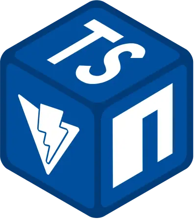

<!-- PROJECT LOGO -->

  

 
<!-- add tech stack badges below -->

    <!-- Title -->
  <h3 align="center">Complete Typescript NPM Package Template</h3>
   <!-- DESCRIPTION -->
  

    An ultimate template for creating a Typescript NPM package with Vite, that can build a live-demo, make unit tests and coverage with vitest, and built-int deploy/build github workflows. + README template
             
     
    <!-- CHANGER IT WITH YOUR GITHUB PAGES LINK -->
    <a href="https://kaandesu.github.io/ts-vite-npm-template/#/">Live Demo</a>
    ·<!-- CHANGER IT WITH YOUR GITHUB ISSUES LINK -->
    <a href="https://github.com/kaandesu/ts-vite-npm-template/issues">Report Bug</a>
    ·<!-- CHANGER IT WITH YOUR GITHUB ISSUES LINK -->
    <a href="https://github.com/kaandesu/ts-vite-npm-template/issues">Request Feature</a>
  

<!-- TABLE OF CONTENTS -->

  
Table of Contents

  <ol>    
    <li><a href="#project-setup">Project Setup</a></li>
    <li><a href="#repository-and-automation-setup">Repository and Automation Setup</a></li>
    <li><a href="#usage">Usage</a></li>
    <li><a href="#roadmap">Roadmap</a></li>
    <li><a href="#contributing">Contributing</a></li>
    <li><a href="#license">License</a></li>
    <li><a href="#contact">Contact</a></li>    
  </ol>

<!-- GETTING STARTED -->

> ⚠️ This README.md mainly contains information about how to setup [project](#project-setup) and the [repository/automation](#repository-and-automation-setup). 
  However, it is mainly made for users to use this as a template to `create their own README`.
Feel free to edit this README.md to your needs. 

## Project Setup
1. **_Package Name Setup:_** Change the package name (every occurrence) in `package.json` and `vite.config.ts` files.

2. **_Write your plguin:_** Write your plugin in `src/myPackagePlugin` folder. As a default entry will be from its `index.ts` file. 
You may change the folder name or the entry file, but don't forget to update the `vite.config.ts` file.

3. **_ChangesetBot_**: Add Changeset Bot and configure. (See [Changeset Bot](https://github.com/apps/changeset-bot) for details) 

## Repository and Automation Setup

1. **_Allow Workflows for Automation_**: Visit `https://github.com/[username]/[REPOSITORY]/settings/actions` and add workflow permissions (read & write)..

2. **_Enable Github Pages:_** If you have a live-demo web, create a new branch called 'gh-pages' for github pages deployment. (The index.html will be built and deployed to this branch seperately from your plugin build. See [deploy.yaml](.github/workflows/deploy.yaml) workflow)

3. **_Branch Security Rules:_** Visit `https://github.com/[username]/[REPOSITORY]/settings/branches` and set the branch protection rules for `main` and `gh-pages` branches. (Require pull request reviews before merging, Require status checks to pass before merging, Require branches to be up to date before merging)

4. **_Codeowners_**: Edit the codeowners file to add your team members as codeowners. (See [CODEOWNERS](CODEOWNERS) for details)

<!-- USAGE EXAMPLES -->

## Usage
> For user to edit this section:

Use this space to show useful examples of how a project can be used. Additional screenshots, code examples and demos work well in this space. You may also link to more resources.

_For more examples, please refer to the [Documentation](https://example.com)_

<!-- ROADMAP -->

## Roadmap
> For user to edit this section:

- [x] Add Changelog
- [x] Add back to top links
- [ ] Add Additional Templates w/ Examples
- [ ] Add "components" document to easily copy & paste sections of the readme
- [ ] Multi-language Support
  - [ ] Chinese
  - [ ] Spanish

<!-- CONTRIBUTING -->

## Contributing

Contributions to the project is highly appreciated.
If you have any suggestions/questions/requests please consider
[opening an issue](https://github.com/kaandesu/ts-vite-npm-template/issues/new). 
If you want to contribute to the project, fixing an open issue is greatly recommended and appreciated. 
To see the all contribution rules please check the [contribution rules](CONTRIBUTING.md).

<!-- LICENSE -->

## License

Distributed under the MIT License. See [LICENSE](LICENSE.md) for more information.

<!-- CONTACT -->

## Contact
> For user to edit this section:

Your Name - [@your_twitter](https://twitter.com/your_username) - email@example.com

Project Link: [https://github.com/your_username/repo_name](https://github.com/your_username/repo_name)

